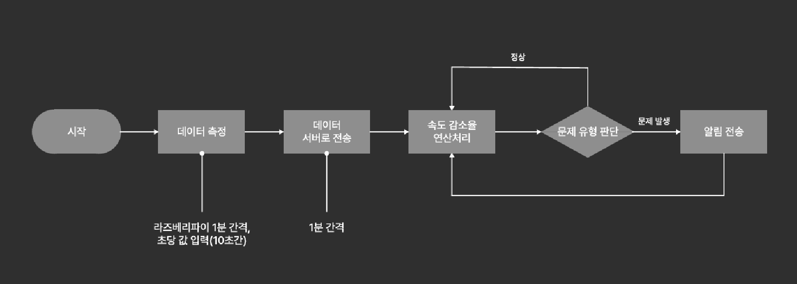
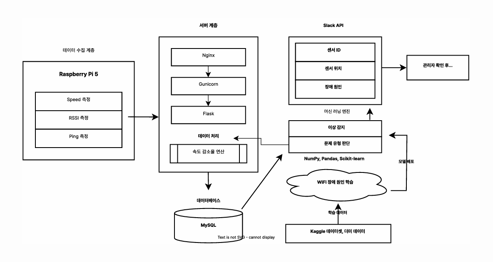
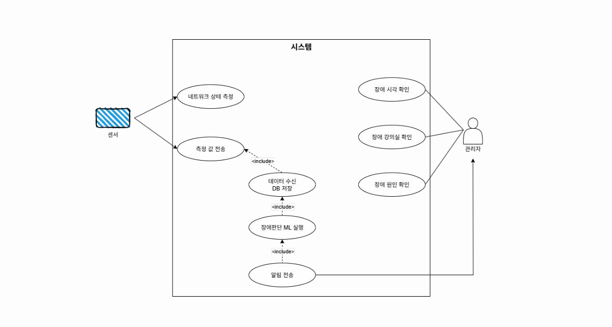
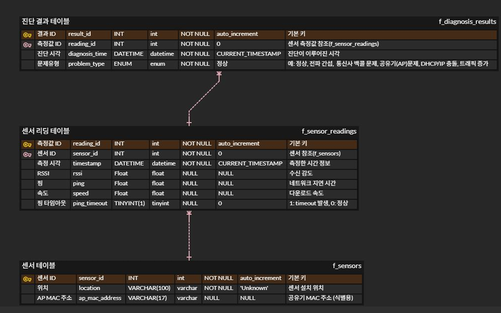

# Wivue 위뷰
본 프로젝트는 교내 와이파이 품질 문제의 근본적인 해결을 목표로 하는 **AI 기반 와이파이 장애 진단 및 대응 지원 시스템**입니다. 

[발표 자료 링크](https://www.figma.com/proto/tArarlOxbjTUDeoSflWEu9/Union-%EB%B0%A9%ED%95%99-%ED%94%84%EB%A1%9C%EC%A0%9D%ED%8A%B8?node-id=661-783&t=93ZImVVQMSQedC45-1&scaling=min-zoom&content-scaling=fixed&page-id=602%3A6&starting-point-node-id=661%3A783) 
 
  
## 💡 주요 기능
#### AI 기반 장애 진단
- 머신러닝 모델을 통해 와이파이 속도, 신호 강도, 핑 테스트 데이터를 분석하여 장애 원인을 진단합니다.
#### 실시간 알림
- 장애 발생 시 Slack 웹훅을 통해 사전에 설정된 채널로 알림을 전송합니다.
- 알림에는 센서 ID, 위치, 장애 원인, 발생 시각 등의 정보가 포함됩니다.
#### 데이터 수집 및 관리
- 라즈베리파이 센서가 네트워크 데이터를 측정하고, 이 데이터는 MySQL 데이터베이스에 저장됩니다.
 

## 🧑‍💻 팀원 구성

|                                                                 **김영모**                                                                  |                                                                 **박재현**                                                                  |                                                               **박재홍**                                                                |                                                                **주희윤**                                                                 |                                                                **차영준**                                                                |
| :-----------------------------------------------------------------------------------------------------------------------------------------: | :-----------------------------------------------------------------------------------------------------------------------------------------: | :-------------------------------------------------------------------------------------------------------------------------------------: | :---------------------------------------------------------------------------------------------------------------------------------------: | :--------------------------------------------------------------------------------------------------------------------------------------: |
| [   @rlazeroah](https://github.com/rlazeroah) | [   @JaeRED914](https://github.com/JaeRED914) | [   @jeahyeon1016](https://github.com/SeongHyunWook) | [   @gmldbs3104](https://github.com/gmldbs3104) | [   @](https://github.com/) |

 

## 🛠️ 개발 환경
- **Hardware**: Raspberry Pi 5 
- **Machine Learning**: NumPy, Pandas, Scikit-learn 
- **Database**: MySQL 
- **Server**: Flask, Amazon EC2, Nginx, Gunicorn 
- **Notification System**: Slack Webhook 
 

## ⚙️ 프로젝트 설계도
#### 플로우차트

#### 아키텍처

#### 유스케이스

#### ERD

 

## 📊 머신러닝 성능 평가
- AI 기반 와이파이 장애 진단 시스템은 랜덤 포레스트(RandomForestClassifier) 알고리즘을 사용합니다.
- 학습에는 각 문제 유형별 1,000개씩, 정상값 5,000개를 포함하여 총 10,000개의 더미 데이터셋이 사용되었습니다.
  
| 문제 유형 | 정확도 / 정밀도 및 재현율 |
|-----------|---------------------------|
| **전체 정확도** | 94.5% |
| **DHCP/IP 충돌, 공유기 문제, 전파 간섭, 정상** | 정확도 100% |
| **통신사 백홀 문제** | 정밀도 69%, 재현율 78% |
| **트래픽 증가 문제** | 정밀도 77%, 재현율 67% |
 

## 🧑‍💻 역할 분담
- **김영모**: 컴퓨터공학전공, 머신러닝
- **박재현**: 전자전기공학부, 하드웨어
- **박재홍**: 컴퓨터공학전공, 머신러닝
- **주희윤**: 컴퓨터공학전공, PM, 백엔드
- **차영준**: 컴퓨터공학전공, DB, 서버
 

## 🎬 시연영상

